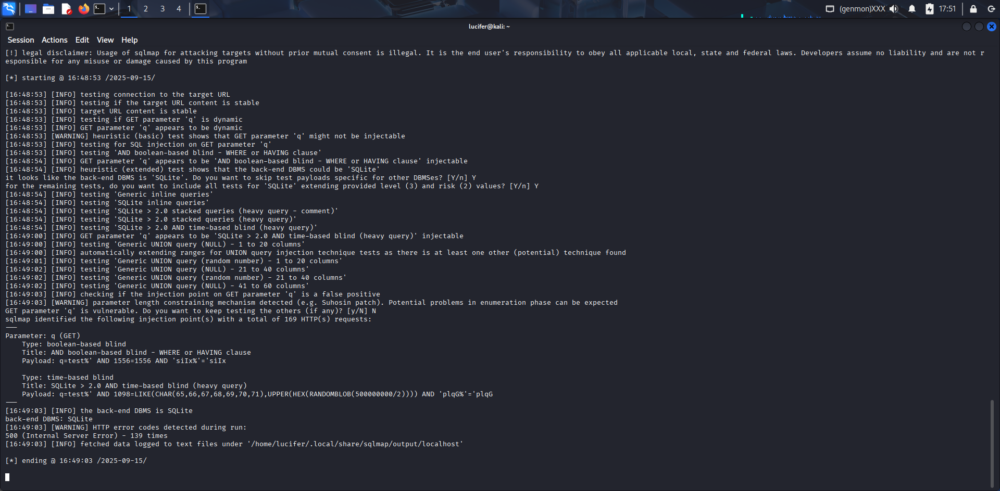
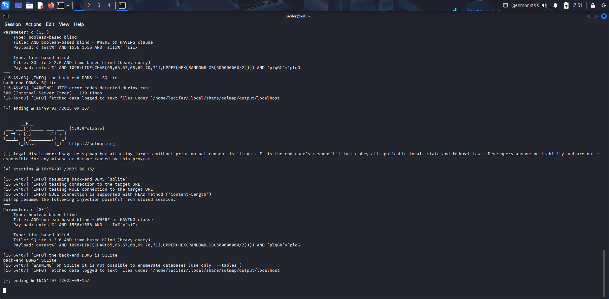
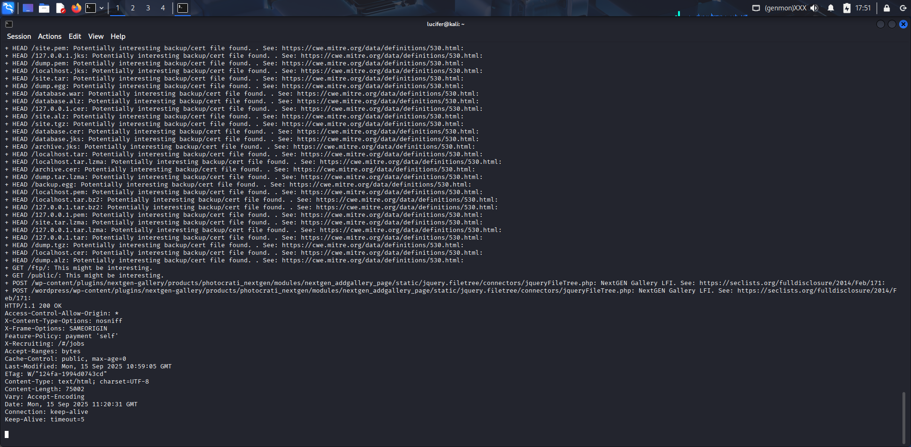
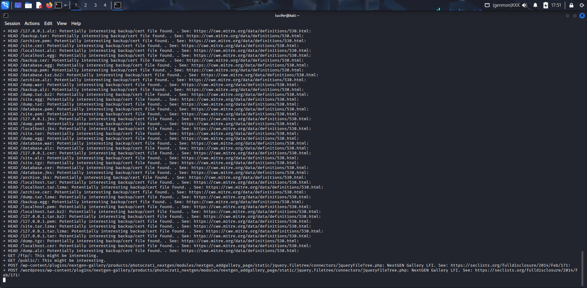

# Security Assessment Report — Web Application Vulnerability Assessment
**Target:** OWASP Juice Shop (local demo)  
**Author:** Nitish Patil  
**Date:** 2025-09-15

---

## Executive Summary
A focused web application vulnerability assessment of a local OWASP Juice Shop instance produced multiple findings: a **confirmed SQL Injection** (boolean & time-based blind) in the product search endpoint, permissive CORS headers (`Access-Control-Allow-Origin: *`), and several backup/archive or plugin paths exposed as identified by Nikto. The SQLi was validated using sqlmap (SQLite backend). Recommended actions: remove public backups, restrict CORS, add security headers, and remediate the SQL injection by using parameterized queries and least-privileged DB accounts. Artifacts and PoCs are provided in the `evidence/` folder.

---

# Findings

### Finding 1 — SQL Injection (confirmed — boolean & time-based blind)
- **Endpoint / parameter:** `GET /rest/products/search?q=<term>`
- **Severity:** High
- **Evidence files:** `evidence/sqlmap_run_level3.txt`, `evidence/sqlmap_dbs.txt`, `evidence/sqlmap_dump_TABLE_NAME_masked.txt`, `evidence/screenshot_sqlmap.png`, `evidence/screenshot_sqlmap_dbs.png`
- **Proof-of-Concept (automated):**  
  sqlmap (level=3, risk=2) against `http://localhost:3000/rest/products/search?q=test` confirmed boolean- and time-based blind injection on parameter `q`. Example payloads captured:
q=test%' AND 1556=1556 AND 'siIx%'='siIx
q=test%' AND 1098=LIKE(CHAR(65,66,67,68,69,70,71),UPPER(HEX(RANDOMBLOB(500000000/2)))) AND 'plqG%'='plqG
The run enumerated schema and table `Cards` and sample values were retrieved (masked). See the sqlmap run output and enumeration screenshots below.

**Impact:** An attacker can infer and exfiltrate database contents (user data, payment card data in this demo), potentially enabling account compromise, data theft, and downstream abuse.

**Remediation:** Replace dynamic SQL with parameterized/prepared statements; validate and sanitize inputs server-side; use least-privileged DB accounts; and apply WAF rules as a temporary mitigation blocking known SQLi patterns.

---

### Finding 2 — Permissive CORS (Access-Control-Allow-Origin: *)
- **Evidence:** `evidence/headers.txt`, `evidence/screenshot_headers.png`
- **Severity:** Medium
- **Description:** The server responds with `Access-Control-Allow-Origin: *`, which allows any origin to read responses in browser contexts. In combination with other vulnerabilities this can facilitate data exfiltration from victim browsers.
- **Remediation:** Restrict `Access-Control-Allow-Origin` to trusted domains, limit allowed methods/headers and avoid `*` in production.

---

### Finding 3 — Backup / archive files & plugin paths exposed
- **Evidence:** `evidence/nikto.txt`, `evidence/screenshot_nikto.png`
- **Severity:** Medium → High (depending on backup contents)
- **Description:** Nikto flagged multiple backup/archive filenames and plugin path patterns found under webroot. Publicly accessible backups may contain credentials or source code.
- **Remediation:** Remove backups from webroot, store them securely offsite, restrict access, and rotate any credentials discovered.

---

### Finding 4 — Missing / weak security headers
- **Evidence:** `evidence/nikto.txt`
- **Severity:** Low → Medium
- **Description:** Some static assets lack hardening headers (e.g., `X-Content-Type-Options: nosniff`), increasing the risk of MIME sniffing and other client-side issues.
- **Remediation:** Add `X-Content-Type-Options: nosniff`, `Content-Security-Policy`, `Strict-Transport-Security`, and `X-Frame-Options` as appropriate.

---

## Proof-of-Concept (summary)
Using sqlmap (level=3, risk=2) confirmed boolean/time-based blind SQL injection on the `q` parameter of `/rest/products/search`. Sqlmap enumerated database information and table `Cards`, and produced a masked dump of sample values (see `evidence/sqlmap_dump_TABLE_NAME_masked.txt`). See `evidence/sqlmap_run_level3.txt` and the embedded screenshots for full execution details.

---

## Recommendations / Remediation checklist

### Immediate (0–24h)
- Remove backups and archive files from webroot and restrict public directories (`/ftp/`, `/public/`).  
- Apply temporary WAF rules to block common SQLi payloads targeting `/rest/products/search?q=`.  
- Restrict CORS to trusted origins.

### Short-term (1–7 days)
- Replace dynamic SQL with parameterized/prepared statements throughout the application.  
- Limit DB account privileges to minimum required.  
- Add security headers: `X-Content-Type-Options: nosniff`, `Content-Security-Policy`, `Strict-Transport-Security`, `X-Frame-Options`.

### Medium-term (1–4 weeks)
- Conduct authenticated manual penetration testing and code review for the search endpoint.  
- Integrate automated security scanning into CI/CD and schedule periodic reviews.

---

## Evidence index
- Nikto scan: `evidence/nikto.txt`, `evidence/screenshot_nikto.png`  
- Sqlmap runs: `evidence/sqlmap_run_level3.txt`, `evidence/sqlmap_dbs.txt`, `evidence/sqlmap_dump_TABLE_NAME_masked.txt`, `evidence/screenshot_sqlmap.png`, `evidence/screenshot_sqlmap_dbs.png`  
- HTTP headers: `evidence/headers.txt`, `evidence/screenshot_headers.png`  

---
